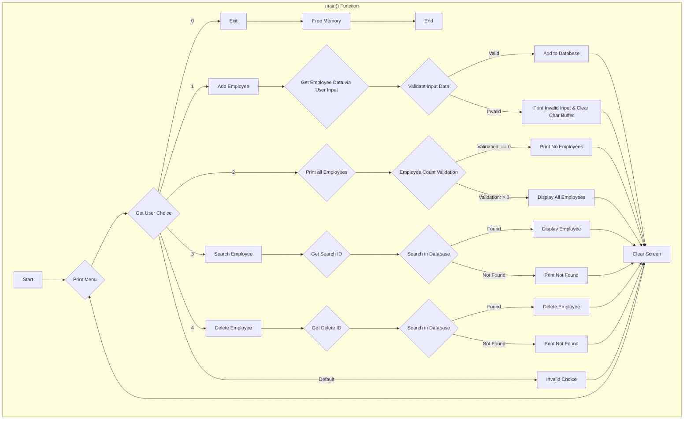

# *Employee Database - Alpha v0.5* 

## About

* Early build, I plan on updating this often, the database will store employees using a file on the disk which isn't added as of this version (0.5)

## Requirments

* Must have [GCC](https://gcc.gnu.org/) installed to compile  
  * For Linux: `sudo apt install gcc`  
  * For Windows: [Tutorial To Install gcc on Windows](https://phoenixnap.com/kb/install-gcc-windows)

## How to build the project from the terminal

### On Linux (from database_project directory)

* `gcc ./app.c -o bin/debug/database && ./bin/debug/database`

### On Windows (from database_project directory)

* `start build`  
or
* `start build-run`  
or with gcc commands
* `gcc -g app.c -o bin/debug/database`

## Flow Chart of Employee Database (WIP)

